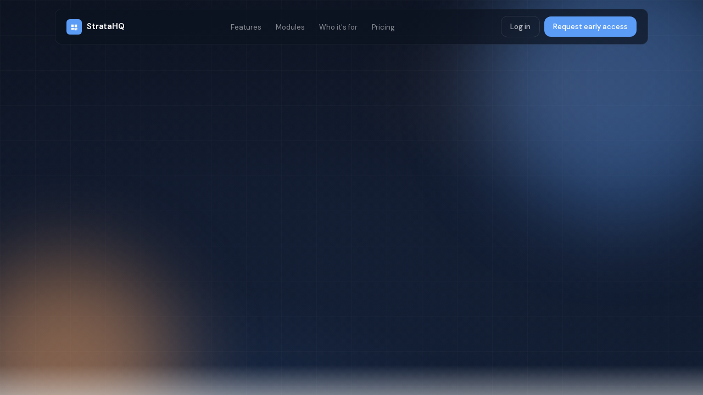
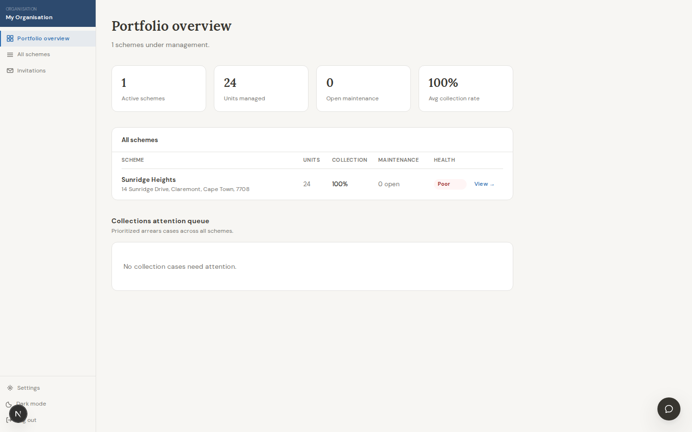
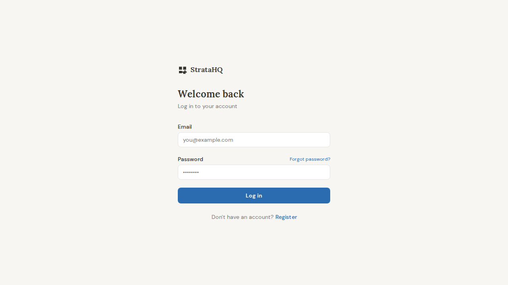
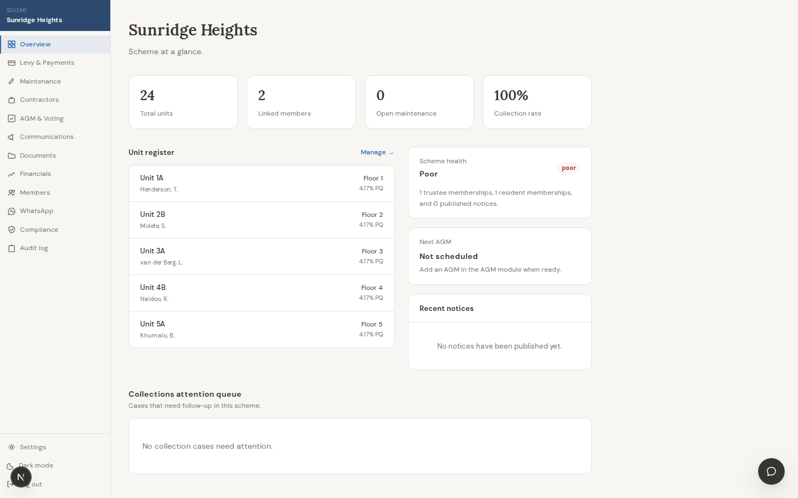
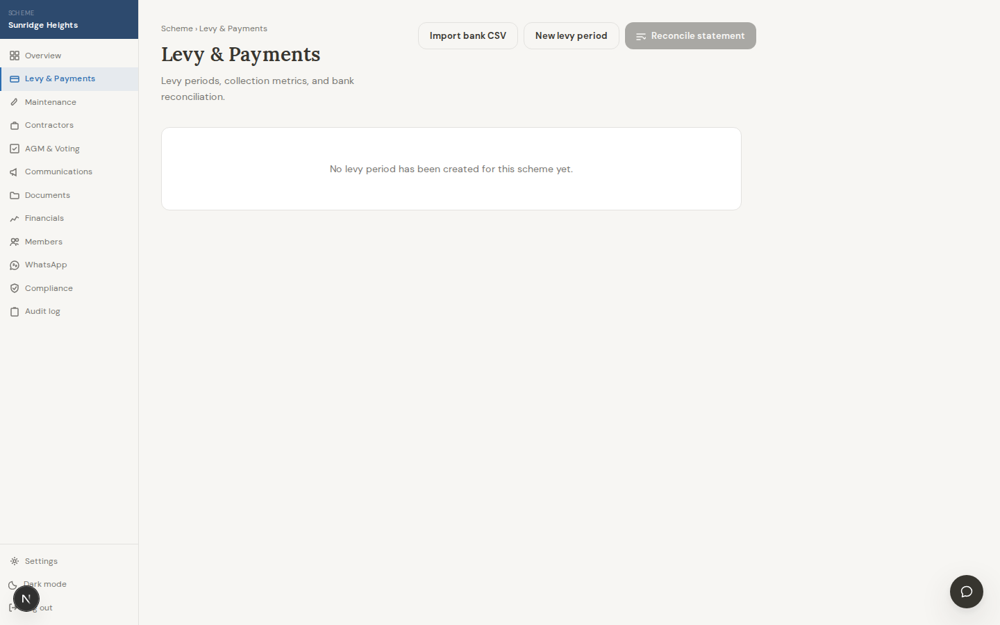
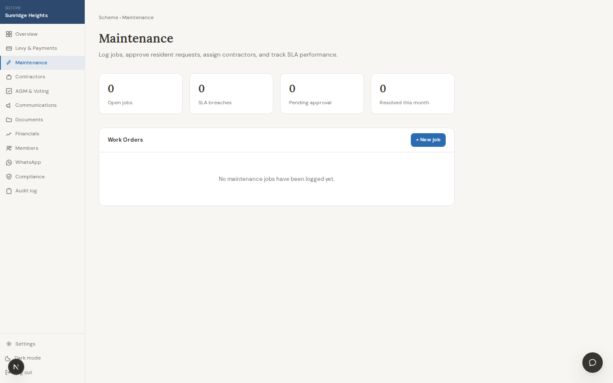
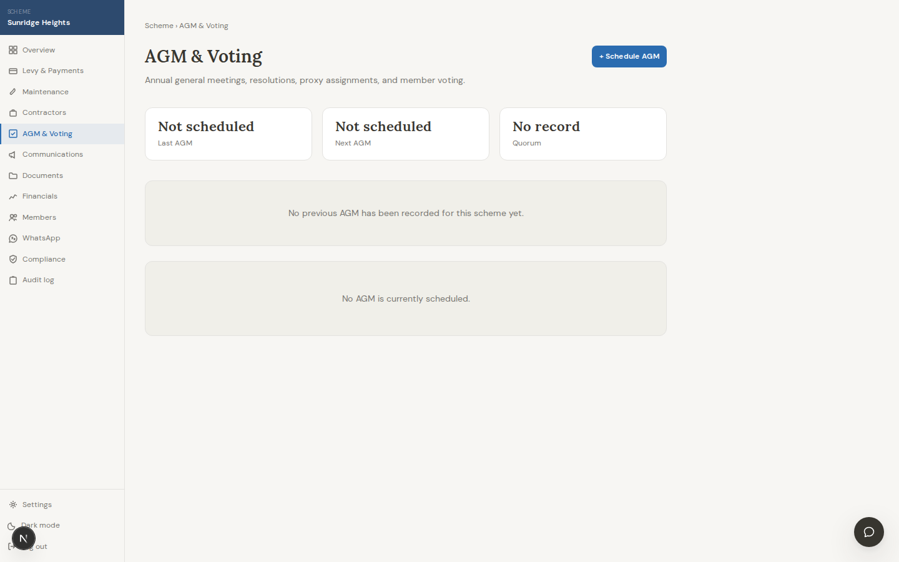
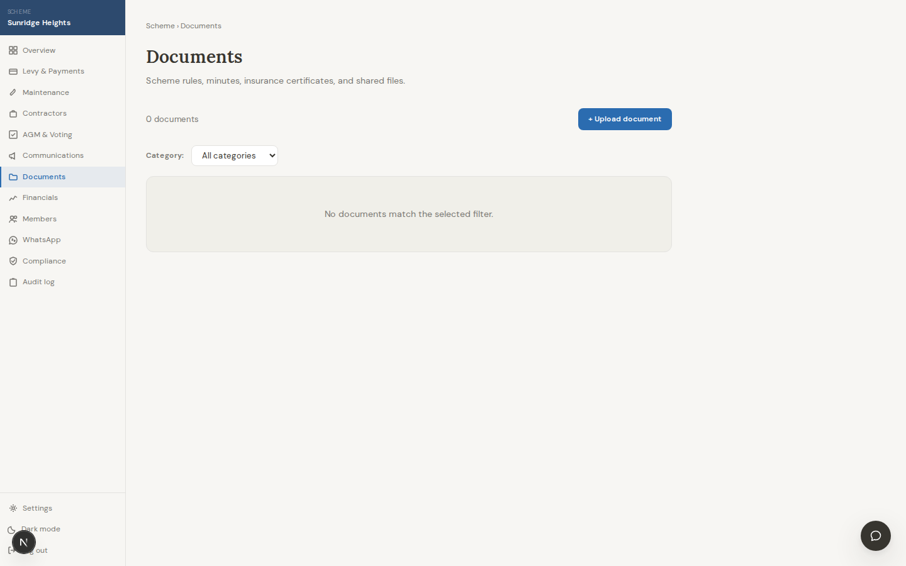

# StrataHQ

StrataHQ is a sectional-title property management platform for South African
managing agents, trustees, and residents. It brings levy operations,
maintenance, governance, documents, communications, and compliance into one
authenticated workspace backed by a Next.js frontend and Go API.

## Live Demo

Demo URL: https://strata-hq-blue.vercel.app

The public demo uses seeded fake data only.

| Role | Email | Password |
| --- | --- | --- |
| Managing agent | `agent@demo.stratahq.test` | `StrataDemo!2026` |
| Trustee | `trustee@demo.stratahq.test` | `StrataDemo!2026` |
| Resident | `resident@demo.stratahq.test` | `StrataDemo!2026` |

## Core Workflows

- Managing-agent portfolio oversight across multiple schemes
- Levy collection, payment tracking, bank-statement import, and reconciliation
- Maintenance request intake, triage, and progress tracking
- AGM, resolutions, and governance workflows
- Document vault, resident communications, and compliance visibility
- Role-aware views for managing agents, trustees, and residents

## Showcase Gallery

Captured from the local seeded demo app on 2026-05-07.

| Public entry points | Core operations |
| --- | --- |
| Landing page<br> | Managing-agent portfolio<br> |
| Login page<br> | Scheme overview<br> |
| Levy reconciliation<br> | Maintenance dashboard<br> |
| AGM workflow<br> | Documents and compliance<br> |

## Core Docs

- [Architecture](docs/architecture.md)
- [API](docs/api.md)
- [Database](docs/database.md)
- [Engineering decisions](docs/engineering-decisions.md)
- [Demo guide](docs/demo.md)
- [Case study](docs/case-study.md)

## Run Locally In 5 Minutes

1. Install dependencies from the repository root:

   ```bash
   npm ci
   ```

2. Create frontend environment variables:

   ```bash
   cp .env.example .env.local
   ```

   If `.env.example` is not present, create `.env.local` manually:

   ```bash
   BACKEND_URL=http://localhost:8080
   NEXT_PUBLIC_API_URL=http://localhost:8080
   ```

3. Start local backend services and seed demo data:

   ```bash
   cd backend
   cp .env.example .env
   make docker-up
   set -a; source .env; set +a
   make migrate-up
   make generate
   SEED_DEMO_PASSWORD='StrataDemo!2026' make seed
   ```

4. Run the backend API:

   ```bash
   cd backend
   make run
   ```

5. In another terminal, run the frontend:

   ```bash
   npm run dev
   ```

Frontend: `http://localhost:3000`
Backend API: `http://localhost:8080`

## Repository Layout

```text
stratahq-app/
├── app/                    # Next.js App Router routes
│   ├── app/[schemeId]/     # Scheme-scoped authenticated product area
│   ├── agent/              # Managing-agent portfolio and settings routes
│   ├── admin/              # Admin tools
│   ├── api/                # Next.js API routes and backend proxy routes
│   ├── auth/               # Login, registration, invitations, password reset
│   └── early-access/       # Early-access signup flows
├── backend/                # Go API, worker, migrations, and integration tests
│   ├── cmd/server/         # API server entrypoint
│   ├── cmd/worker/         # Background worker entrypoint
│   ├── db/                 # Goose migrations, sqlc queries, generated code
│   ├── internal/           # Backend domains and shared platform packages
│   └── tests/              # Integration and load tests
├── components/             # Shared React UI components
├── hooks/                  # Shared React hooks
├── lib/                    # Frontend API clients, auth helpers, utilities
├── public/                 # Static assets
└── docs/                   # Showcase docs, reliability notes, specs, roadmap
```

## Tech Stack

| Layer | Technology |
| --- | --- |
| Frontend | Next.js 16, React 19, TypeScript, Tailwind CSS |
| Frontend data | Server actions, server components, React Query |
| Backend | Go 1.25.0+, Chi, pgx/v5, sqlc, goose |
| Data stores | PostgreSQL 17, Redis 7 |
| Auth | Backend-issued JWT access and refresh tokens |
| Payments | Stripe |
| Email | Resend |
| WhatsApp | Twilio WhatsApp |
| AI | DeepSeek via OpenAI-compatible API |
| Testing | Vitest, Testing Library, Go tests, integration tests, k6 |

## Engineering Decisions Summary

StrataHQ keeps the product UI in Next.js, core business logic in a Go backend,
PostgreSQL as the source of truth, Redis for support concerns, typed SQL access
through `sqlc`, and a separate worker for async jobs. The tradeoffs and
rationale are documented in [docs/engineering-decisions.md](docs/engineering-decisions.md).

## Release Status

Current beta milestone: `v0.2.0-beta.0`

- The previous showcase checkpoint, `v0.1.0-alpha`, has been tagged.
- The main branch is deployed to the public demo environment with seeded fake
  data only.
- Product, API, security, and reliability hardening are sufficient for beta
  review across managing-agent, trustee, and resident workflows.
- Treat this beta as review/demo-ready software. Full production still requires
  the production launch gate in
  [docs/production-reliability-runbook.md](docs/production-reliability-runbook.md),
  including load-test evidence and production environment sign-off.

## Testing And Verification

Run the checks that match your change before opening a PR or deploying:

```bash
npm run lint
npm run typecheck
npm test
```

For backend changes:

```bash
cd backend
make test
make test-integration
```

Integration tests require local PostgreSQL and Redis services. Start them with
`make docker-up` before running integration tests.

## Prerequisites

- Node.js 22 or newer
- npm
- Go 1.25.0 or newer
- Docker and Docker Compose
- sqlc
- goose
- golangci-lint, for backend linting

## Local Development

Frontend commands run from the repository root.

| Command | Description |
| --- | --- |
| `npm run dev` | Start the Next.js development server |
| `npm run build` | Build the production frontend |
| `npm run start` | Start the built frontend |
| `npm run lint` | Run ESLint with zero warnings allowed |
| `npm run typecheck` | Run TypeScript checks |
| `npm test` | Run Vitest once |
| `npm run test:watch` | Run Vitest in watch mode |

Backend commands run from `backend/`.

| Command | Description |
| --- | --- |
| `make run` | Start the Go API server |
| `make worker` | Start the background worker |
| `make build` | Build API and worker binaries |
| `make test` | Run backend unit tests |
| `make test-integration` | Run backend integration tests |
| `make lint` | Run golangci-lint |
| `make fmt` | Format Go code |
| `make generate` | Regenerate sqlc code |
| `make migrate-up` | Run pending database migrations |
| `make migrate-down` | Roll back the latest migration |
| `make seed` | Seed local demo data |
| `make docker-up` | Start local Postgres and Redis |
| `make docker-down` | Stop local Docker services |

See [backend/README.md](backend/README.md) for backend API details, response
format, endpoint notes, and domain development guidance.

## Environment Variables

### Frontend

Create `.env.local` at the repository root.

| Variable | Purpose | Local default |
| --- | --- | --- |
| `BACKEND_URL` | Server-side URL used by server components, server actions, and API routes | `http://localhost:8080` |
| `NEXT_PUBLIC_API_URL` | Browser-visible API URL for client-side backend calls | `http://localhost:8080` |

### Backend

Create `backend/.env` from [backend/.env.example](backend/.env.example).
Important variables include:

| Variable | Purpose |
| --- | --- |
| `DATABASE_URL` | PostgreSQL connection string |
| `REDIS_URL` | Redis connection string |
| `JWT_SECRET` | JWT signing secret |
| `STRIPE_SECRET_KEY` | Stripe API key |
| `STRIPE_WEBHOOK_SECRET` | Stripe webhook signing secret |
| `STRIPE_PRICE_ID` | Stripe price identifier |
| `RESEND_API_KEY` | Transactional email API key |
| `AI_BASE_URL`, `AI_API_KEY`, `AI_MODEL` | AI provider configuration |
| `ALLOWED_ORIGINS` | Comma-separated CORS origins |
| `APP_BASE_URL` | Frontend URL for callbacks and email links |
| `BACKEND_BASE_URL` | Backend URL for backend-generated links |
| `TWILIO_ACCOUNT_SID`, `TWILIO_AUTH_TOKEN`, `TWILIO_WHATSAPP_NUMBER` | WhatsApp integration settings |

Never commit real secrets. Use local `.env` files for development and platform
secret stores in production.

## Authenticated App Areas

- `/agent` shows the managing-agent portfolio dashboard.
- `/agent/schemes`, `/agent/invitations`, `/agent/settings`, and
  `/agent/setup` support portfolio administration.
- `/app/[schemeId]` is the scheme overview.
- `/app/[schemeId]/levy`, `/maintenance`, `/agm`, `/documents`,
  `/financials`, `/members`, `/communications`, `/compliance`, `/contractors`,
  `/whatsapp`, `/audit`, `/profile`, and `/settings` expose scheme modules.
- `/auth/login`, `/auth/register`, `/auth/invite/[token]`,
  `/auth/forgot-password`, and `/auth/reset-password` handle authentication.
- `/admin/early-access` supports early-access administration.

The frontend reads authenticated server-side data through `lib/server-api.ts`
and proxies allowed `/api/v1/*` calls through `app/api/proxy/[...path]`.

## Reference Docs

- [docs/architecture.md](docs/architecture.md) - system structure and major
  components
- [docs/api.md](docs/api.md) - API surface and integration details
- [docs/database.md](docs/database.md) - schema and data model reference
- [docs/engineering-decisions.md](docs/engineering-decisions.md) - rationale
  and tradeoffs behind current architecture
- [docs/demo.md](docs/demo.md) - demo accounts, walkthrough, and screenshot
  guidance
- [docs/case-study.md](docs/case-study.md) - showcase narrative and product
  framing
- [backend/README.md](backend/README.md) - backend setup, API overview, and
  backend development workflow
- [backend/CONTRIBUTING.md](backend/CONTRIBUTING.md) - backend contribution
  guidance
- [docs/production-reliability-runbook.md](docs/production-reliability-runbook.md)
  - production reliability and load-test guidance
- [docs/roadmap/](docs/roadmap/) - roadmap specs and implementation plans
- [APP_TESTING.md](APP_TESTING.md), [DEMO_TESTING.md](DEMO_TESTING.md), and
  [SECURITY_AUDIT.md](SECURITY_AUDIT.md) - additional testing and audit notes

## Deployment Notes

The frontend is designed for Vercel-style Next.js deployment. The backend is a
containerized Go service with a separate worker and expects managed PostgreSQL
and Redis in production. Configure production environment variables in the
target platform and use TLS-enabled database connections.

## License

Proprietary. All rights reserved.
