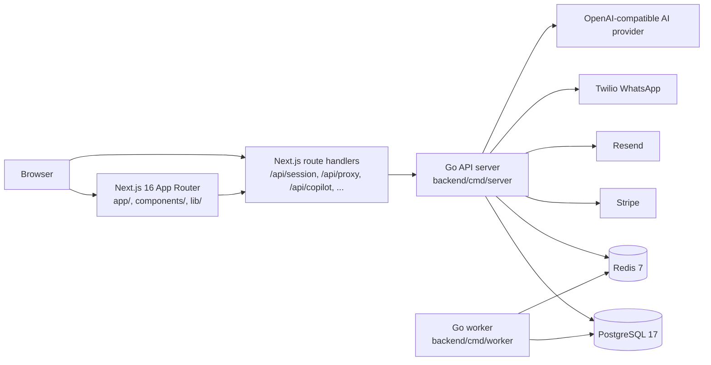

# StrataHQ Architecture

StrataHQ is a full-stack property management system with a Next.js frontend and a Go backend API. The application separates presentation, authenticated proxy/session handling, domain logic, persistence, and background work.

## System Diagram

## Request Flow

1. Browser requests render through the Next.js App Router.
2. Server components and client APIs call the backend through local helpers in `lib/`.
3. Browser-originated backend calls from `lib/api.ts` are sent to `/api/proxy/api/v1/*`, while dedicated handlers such as `/api/session` and `/api/copilot` serve Next.js-owned routes.
4. The Go backend routes requests through Chi in `backend/internal/server/router.go`.
5. Domain handlers call services in `backend/internal/<domain>/`.
6. Services use sqlc-generated queries from `backend/db/gen/`.
7. PostgreSQL stores durable domain data; Redis supports cache/session/rate-limit flows.

## Auth And Session Flow

1. The backend issues JWT access tokens and refresh tokens.
2. Refresh tokens are stored server-side and can be revoked or rotated.
3. Next.js server code writes the access, refresh, session, and CSRF cookies; the browser stores them, and the CSRF cookie remains browser-readable for mutating proxy requests.
4. CSRF protection and origin checks guard mutating frontend proxy requests.
5. Backend middleware validates bearer tokens and injects identity context.

## Backend Domain Layout

### Domain Modules

Product-facing domain modules under `backend/internal/`:

| Module | Responsibility |
| --- | --- |
| `auth` | Register, login, refresh, logout, profile, org setup, password flows |
| `invitation` | Invite creation, verification, acceptance, resend, revocation |
| `scheme` | Schemes, units, members |
| `levy` | Levy periods, accounts, payments, reconciliation, collection follow-up |
| `maintenance` | Maintenance dashboards, creation, assignment, resolution |
| `agm` | Meetings, resolutions, voting, proxy assignments |
| `documents` | Scheme document records and visibility |
| `financials` | Budget and reserve-fund views |
| `communications` | Notices and scheme communications |
| `compliance` | Compliance items and assessments |
| `whatsapp` | WhatsApp inbox, broadcasts, maintenance intake |
| `billing` | Stripe checkout, portal, subscription state, webhooks |
| `earlyaccess` | Early-access capture, review, and admin flows |
| `contractors` | Contractor directory, marketplace, and reviews |
| `integrations` | API clients and open API endpoints |
| `ai` | AI copilot request handling and provider integration |
| `audit` | Resource audit event retrieval |

### Supporting/Internal Infrastructure

Supporting internal modules under `backend/internal/`:

| Module | Responsibility |
| --- | --- |
| `jobs` | Background job execution, leasing, and handler registry |
| `middleware` | HTTP auth, rate limiting, CORS, security headers, audit, and request lifecycle middleware |
| `platform` | Shared database, cache, and health primitives |
| `notification` | Email delivery client setup |
| `twilio` | Twilio WhatsApp sender integration |
| `server` | Router and HTTP server composition |
| `config` | Environment/config loading |
| `security` | Shared security helpers |
| `seed` | Demo/dev data seeding support |

## Deployment Shape

The frontend is suitable for Vercel-style Next.js deployment. The backend is a containerized Go service with a separate worker process. Production deployments require managed PostgreSQL, Redis, TLS-enabled database connections, and provider secrets configured outside the repository.

## Reliability And Security Boundaries

- The backend owns business rules and persistence.
- The frontend proxy centralizes browser-facing backend access.
- PostgreSQL migrations are the schema source of truth.
- sqlc gives typed database access without an ORM.
- Redis-backed rate limiting protects sensitive endpoints.
- Audit/resource event logging records important domain changes.
- External providers are isolated behind service clients.
