# StrataHQ Database Schema Overview

StrataHQ stores its durable application state in PostgreSQL. The schema source of truth is `backend/db/migrations/`; the typed access layer is generated from `backend/db/queries/` into `backend/db/gen/` with `sqlc`.

## Schema Principles

- Migrations are the canonical schema definition. Table shape, constraints, indexes, enums, and security settings should be read from `backend/db/migrations/*.sql`.
- The model is relational and tenant-aware. `orgs` own managing-agent scope, `schemes` represent managed communities, and most product tables hang off `org_id`, `scheme_id`, `unit_id`, or a domain-specific child key.
- UUID primary keys are used across the domain, with foreign keys and `ON DELETE` behavior expressing lifecycle rules explicitly.
- Status-heavy workflows use database enums or constrained text fields to keep state machines narrow and queryable.
- Auditability and operations are first-class concerns: the schema includes request audit logs, resource-level audit trails, bank import workflows, WhatsApp intake records, and a background job queue.
- Row level security is enabled across public tables by the Supabase hardening follow-up migrations (`00019`, `00023`) and reinforced on tables added later.
- Many mutable domain tables keep `updated_at` current through the shared `set_updated_at()` trigger function created in `00001_init.sql`, while some workflow tables manage `updated_at` in application/query logic instead.

## Domain Table Overview

### Identity and tenancy

| Tables | Purpose |
| --- | --- |
| `users` | Application identities, login credentials, and profile fields such as `phone`. |
| `orgs` | Managing-agent organizations, including contact email and phone. |
| `org_memberships` | User membership within an org, with org-scoped roles. |
| `refresh_tokens` | Server-side refresh-token storage and revocation state. |
| `invitations` | Trustee/resident onboarding invites linked to org, scheme, and optional unit. |

### Schemes and occupancy

| Tables | Purpose |
| --- | --- |
| `schemes` | Body-corporate / HOA entities managed by an org. |
| `units` | Physical units within a scheme, including section value basis points. |
| `scheme_memberships` | User membership in a scheme, optionally tied to a unit. |

### Levies, collections, and bank statement imports

| Tables | Purpose |
| --- | --- |
| `levy_periods` | Scheme-level levy cycles and due dates. |
| `levy_accounts` | Per-unit levy obligations for a levy period, with payment progress and status. |
| `levy_payments` | Individual payments against levy accounts, keyed by unique reference. |
| `collection_events` | Collection follow-up history, including promise-to-pay and delivery metadata for reminders. |
| `bank_statement_imports` | Uploaded bank CSV imports with reconciliation lifecycle counters and error state. |
| `bank_statement_rows` | Parsed bank statement rows, matching confidence, and links to levy accounts/payments when reconciled. |

### Maintenance and contractors

| Tables | Purpose |
| --- | --- |
| `maintenance_requests` | Maintenance tickets raised against schemes and optional units, with SLA and contractor assignment fields. |
| `contractors` | Contractor directory records, org-owned but optionally exposed to a public marketplace. |
| `scheme_contractors` | Scheme-to-contractor links, including preferred status. |
| `contractor_reviews` | Reviews of contractor work tied to maintenance requests. |

### AGM and governance

| Tables | Purpose |
| --- | --- |
| `agm_meetings` | AGM meeting schedule, quorum state, and lifecycle status. |
| `agm_resolutions` | Meeting resolutions with vote totals and result state. |
| `proxy_assignments` | Vote delegation between users for a meeting. |
| `agm_votes` | One recorded vote per voter per resolution. |

### Documents and communications

| Tables | Purpose |
| --- | --- |
| `scheme_documents` | Scheme document metadata, storage keys, categories, and visibility. |
| `notices` | Scheme notices sent by users, including notice type and sent timestamp. |

### Financials

| Tables | Purpose |
| --- | --- |
| `budget_lines` | Budget-versus-actual rows per scheme, category, and period label. |
| `reserve_fund` | One reserve-fund balance/target record per scheme. |

### Compliance

| Tables | Purpose |
| --- | --- |
| `compliance_items` | Scheme compliance obligations, status, dates, detail, and action fields. |
| `compliance_assessments` | Point-in-time compliance scoring snapshots per scheme. |

### WhatsApp messaging and intake

| Tables | Purpose |
| --- | --- |
| `whatsapp_threads` | Scheme/unit conversation threads, consent state, and unread counters. |
| `whatsapp_messages` | Individual WhatsApp messages within a thread, optionally linked to notices or maintenance requests. |
| `whatsapp_broadcasts` | Bulk WhatsApp announcements sent for a scheme. |
| `whatsapp_message_media` | Media attachments attached to WhatsApp messages. |
| `whatsapp_maintenance_intakes` | Candidate maintenance tickets extracted from WhatsApp messages and later dismissed or converted. |

### Billing, early access, and integrations

| Tables | Purpose |
| --- | --- |
| `org_subscriptions` | Billing/subscription state for an org, including provider IDs and renewal dates. |
| `early_access_requests` | Lead capture and approval/rejection state for early-access signups. |
| `integration_api_clients` | API key clients issued by an org, with hashed credentials and scopes. |
| `integration_api_client_schemes` | Scheme grants for integration API clients. |

### Audit and background jobs

| Tables | Purpose |
| --- | --- |
| `audit_events` | Request-level audit log for HTTP access metadata and response status. |
| `resource_audit_events` | Domain resource change history with before/after JSON state. |
| `background_jobs` | Database-backed job queue for asynchronous work with leasing, retries, and idempotency keys. |

## Core Relationship Sketch

This is a simplified ER-style view of the central domain graph. It highlights the tables most other workflows branch from rather than every foreign key in the schema.

```mermaid
erDiagram
    users ||--o{ org_memberships : belongs_to
    orgs ||--o{ org_memberships : has
    orgs ||--o{ schemes : owns
    users ||--o{ refresh_tokens : has
    orgs ||--o| org_subscriptions : billed_by

    schemes ||--o{ units : contains
    users ||--o{ scheme_memberships : joins
    schemes ||--o{ scheme_memberships : grants_access
    units ||--o{ scheme_memberships : optional_unit
    orgs ||--o{ invitations : sends
    schemes ||--o{ invitations : targets
    units ||--o{ invitations : optional_unit

    schemes ||--o{ levy_periods : bills
    levy_periods ||--o{ levy_accounts : creates
    units ||--o{ levy_accounts : owes
    levy_accounts ||--o{ levy_payments : paid_by
    levy_accounts ||--o{ collection_events : followed_up_by
    schemes ||--o{ bank_statement_imports : imports
    bank_statement_imports ||--o{ bank_statement_rows : parses

    schemes ||--o{ maintenance_requests : receives
    units ||--o{ maintenance_requests : raised_for
    orgs ||--o{ contractors : manages
    contractors ||--o{ contractor_reviews : reviewed_in
    schemes ||--o{ scheme_contractors : links
    contractors ||--o{ scheme_contractors : linked_to
    maintenance_requests }o--o| contractors : assigned_to

    schemes ||--o{ agm_meetings : schedules
    agm_meetings ||--o{ agm_resolutions : includes
    agm_meetings ||--o{ proxy_assignments : delegates
    agm_resolutions ||--o{ agm_votes : records

    schemes ||--o{ scheme_documents : stores
    schemes ||--o{ notices : sends
    users ||--o{ notices : authored

    schemes ||--o{ budget_lines : budgets
    schemes ||--o| reserve_fund : reserves

    schemes ||--o{ compliance_items : tracks
    schemes ||--o{ compliance_assessments : scores

    schemes ||--o{ whatsapp_threads : chats
    units ||--o{ whatsapp_threads : chat_for
    whatsapp_threads ||--o{ whatsapp_messages : contains
    whatsapp_messages ||--o{ whatsapp_message_media : attaches
    whatsapp_messages ||--o| whatsapp_maintenance_intakes : intake_source
    schemes ||--o{ whatsapp_broadcasts : broadcasts
    maintenance_requests ||--o{ whatsapp_messages : referenced_by
    notices ||--o{ whatsapp_messages : referenced_by

    orgs ||--o{ integration_api_clients : issues
    integration_api_clients ||--o{ integration_api_client_schemes : scoped_to
    schemes ||--o{ integration_api_client_schemes : permitted_for

    orgs ||--o{ audit_events : audited
    users ||--o{ audit_events : acts_in
    orgs ||--o{ resource_audit_events : resource_audit
    users ||--o{ resource_audit_events : changes
```

## Data Access Pattern

The repository uses a straight-through database flow:

1. Add or change schema in `backend/db/migrations/`.
2. Define the SQL operations in focused files under `backend/db/queries/` such as `auth.sql`, `levy.sql`, `maintenance.sql`, or `whatsapp.sql`.
3. Run `sqlc` generation so typed query methods and models are refreshed under `backend/db/gen/`.
4. Backend services in `backend/internal/*` call the generated query layer instead of embedding ad hoc SQL in handlers.

This keeps schema evolution, query definitions, generated types, and service usage aligned in a single pipeline.

## Coverage Notes

As of the current migration set (`00001` through `00029`), the schema families present in the repository cover identity, schemes, levies, bank statement imports, maintenance, AGM, documents, financials, communications, compliance, WhatsApp, billing, early access, integrations, contractors, audit, and background jobs.
