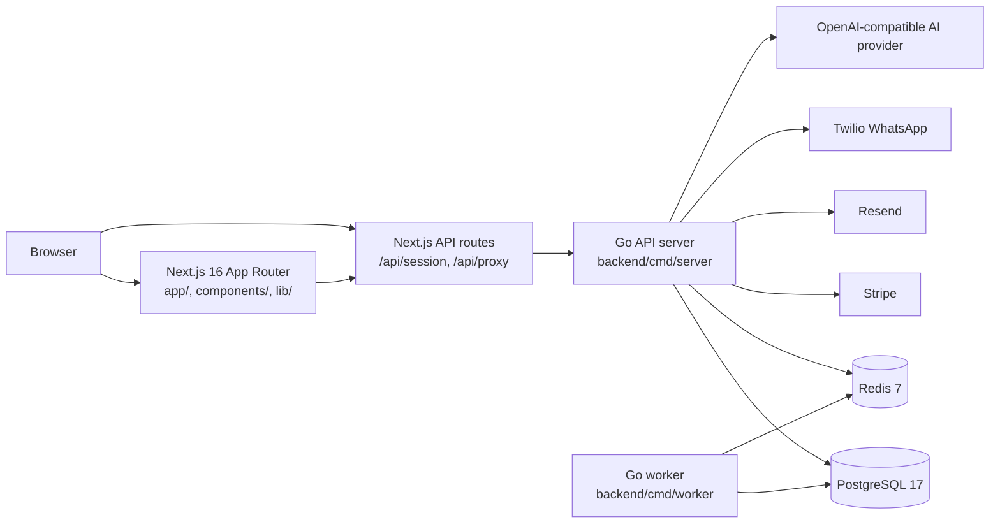
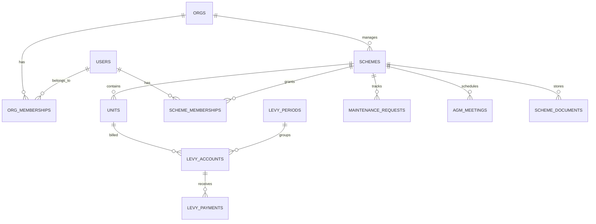

# StrataHQ Showcase Package Implementation Plan

> **For agentic workers:** REQUIRED SUB-SKILL: Use superpowers:subagent-driven-development (recommended) or superpowers:executing-plans to implement this plan task-by-task. Steps use checkbox (`- [ ]`) syntax for tracking.

**Goal:** Add a complete StrataHQ showcase package: live demo credentials, architecture/API/database docs, screenshots, local run path, engineering decisions, case study, demo video script, and `v0.1.0-alpha` release instructions.

**Architecture:** Keep the app unchanged and make the repository the showcase surface. `README.md` becomes the evaluator entry point, while focused docs under `docs/` hold the deeper technical and portfolio material. Screenshot assets live under `docs/assets/screenshots/` only when captured and verified from the local seeded app.

**Tech Stack:** Markdown, Mermaid diagrams, Next.js/Vitest/TypeScript verification, Go route/migration source inspection, optional Playwright-based screenshot capture via `npx playwright`.

---

## File Structure

Create:

- `docs/demo.md` - live demo URL, role credentials, local demo reset checklist, workflow walkthroughs, video script/storyboard, screenshot capture instructions.
- `docs/architecture.md` - Mermaid architecture diagram, request flow, auth/session flow, deployment shape.
- `docs/api.md` - API endpoint reference grouped by backend domain using current `routes.go` files.
- `docs/database.md` - schema overview grouped by migration/domain.
- `docs/engineering-decisions.md` - concise decision log with tradeoffs.
- `docs/case-study.md` - portable portfolio case study.
- `docs/assets/screenshots/.gitkeep` - keeps screenshot directory in git when screenshots cannot be captured.

Modify:

- `README.md` - front-door showcase: demo credentials, screenshots/gallery or capture status, docs links, 5-minute setup, release status, engineering decisions summary.

Optional generated assets:

- `docs/assets/screenshots/landing-page.png`
- `docs/assets/screenshots/login-page.png`
- `docs/assets/screenshots/agent-portfolio-dashboard.png`
- `docs/assets/screenshots/scheme-overview.png`
- `docs/assets/screenshots/levy-reconciliation.png`
- `docs/assets/screenshots/maintenance-dashboard.png`
- `docs/assets/screenshots/agm-workflow.png`
- `docs/assets/screenshots/documents-compliance.png`

Do not create:

- A new app route
- A hosted video file
- A public tag before docs are committed and verified

---

### Task 1: Create Demo Documentation

**Files:**
- Create: `docs/demo.md`
- Create: `docs/assets/screenshots/.gitkeep`

- [ ] **Step 1: Create the screenshot directory marker**

Use `apply_patch` to add:

```text
docs/assets/screenshots/.gitkeep
```

with an empty file body.

- [ ] **Step 2: Create `docs/demo.md` with concrete demo content**

Use `apply_patch` to create `docs/demo.md` with this structure and content:

```markdown
# StrataHQ Demo

## Live Demo

Live app: https://strata-hq-blue.vercel.app

The public demo uses seeded fake data only. Do not connect these accounts to real schemes, residents, owner records, payment data, or contact details.

| Role | Email | Password | What to review |
| --- | --- | --- | --- |
| Managing agent | `agent@demo.stratahq.test` | `StrataDemo!2026` | Portfolio dashboard, scheme operations, invitations, collection workflows |
| Trustee | `trustee@demo.stratahq.test` | `StrataDemo!2026` | Scheme-level oversight, levy status, maintenance, AGM, documents |
| Resident | `resident@demo.stratahq.test` | `StrataDemo!2026` | Resident view, unit-linked scheme activity, profile workflows |

## Demo Data Reset Checklist

Use this checklist before sharing or recording the demo:

1. Confirm the demo backend points at a dedicated demo database.
2. Set `SEED_DEMO_PASSWORD=StrataDemo!2026`.
3. Run the backend seed command against the demo environment.
4. Confirm the three demo users can log in.
5. Confirm all visible scheme, resident, owner, payment, and communication data is fake.
6. Reset or reseed the demo environment after public testing sessions.

Local seed command:

```bash
cd backend
SEED_DEMO_PASSWORD='StrataDemo!2026' make seed
```

## Suggested Demo Walkthrough

1. Open the live app and log in as the managing-agent user.
2. Review the portfolio dashboard and attention queue.
3. Open a scheme and review the scheme overview.
4. Open levy management and show reconciliation/import workflows.
5. Open maintenance and show request triage.
6. Open AGM or documents to show scheme governance workflows.
7. Log out and briefly compare trustee/resident access.

## Screenshot Inventory

Screenshots are stored in `docs/assets/screenshots/` when captured from the seeded app.

Target screenshots:

| File | View | URL |
| --- | --- | --- |
| `landing-page.png` | Public landing page | `/` |
| `login-page.png` | Login page | `/auth/login` |
| `agent-portfolio-dashboard.png` | Managing-agent portfolio dashboard | `/agent` |
| `scheme-overview.png` | Scheme overview | `/app/[schemeId]` |
| `levy-reconciliation.png` | Levy dashboard and reconciliation | `/app/[schemeId]/levy` |
| `maintenance-dashboard.png` | Maintenance dashboard | `/app/[schemeId]/maintenance` |
| `agm-workflow.png` | AGM dashboard | `/app/[schemeId]/agm` |
| `documents-compliance.png` | Documents or compliance workflow | `/app/[schemeId]/documents` or `/app/[schemeId]/compliance` |

## Screenshot Capture Commands

Start the stack:

```bash
npm ci
cp .env.example .env.local
cd backend
cp .env.example .env
make docker-up
make migrate-up
SEED_DEMO_PASSWORD='StrataDemo!2026' make seed
make run
```

In another terminal:

```bash
npm run dev
```

Capture public screenshots:

```bash
npx playwright screenshot http://localhost:3000 docs/assets/screenshots/landing-page.png
npx playwright screenshot http://localhost:3000/auth/login docs/assets/screenshots/login-page.png
```

Authenticated screenshots require logging in first. Use Playwright codegen or the browser to log in as `agent@demo.stratahq.test`, then capture the app views after session cookies are set.

## Demo Video Script

Demo video: not yet recorded

Target length: 90-120 seconds.

Script:

1. "StrataHQ is a sectional-title property management platform for South African managing agents, trustees, and residents."
2. "I will use a seeded demo account so no real resident or scheme data is shown."
3. Log in as `agent@demo.stratahq.test`.
4. Show the managing-agent portfolio dashboard and point out scheme attention items.
5. Open a scheme and show the scheme overview.
6. Open the levy dashboard and show payment/reconciliation workflows.
7. Open maintenance and show request triage.
8. Briefly show AGM, documents, or compliance to demonstrate governance coverage.
9. Close on the README docs: architecture, API reference, database overview, engineering decisions, and local setup.

Recording checklist:

1. Reset demo data before recording.
2. Use a browser profile with no personal bookmarks or extensions visible.
3. Keep the video under two minutes.
4. Do not show environment variables, private dashboards, real emails, or live provider secrets.
```

- [ ] **Step 3: Verify the demo doc has no broken relative links**

Run:

```bash
rg -n "\]\(" docs/demo.md
```

Expected: no local links yet, or only links to files that exist.

- [ ] **Step 4: Commit demo docs**

Run:

```bash
git add docs/demo.md docs/assets/screenshots/.gitkeep
git commit -m "docs: add StrataHQ demo guide"
```

---

### Task 2: Add Architecture Documentation

**Files:**
- Create: `docs/architecture.md`

- [ ] **Step 1: Create the architecture doc**

Use `apply_patch` to create `docs/architecture.md` with this content:

````markdown
# StrataHQ Architecture

StrataHQ is a full-stack property management system with a Next.js frontend and a Go backend API. The application separates presentation, authenticated proxy/session handling, domain logic, persistence, and background work.

## System Diagram



## Request Flow

1. Browser requests render through the Next.js App Router.
2. Server components and client APIs call the backend through local helpers in `lib/`.
3. Browser-originated `/api/v1/*` requests go through `app/api/proxy/[...path]`.
4. The Go backend routes requests through Chi in `backend/internal/server/router.go`.
5. Domain handlers call services in `backend/internal/<domain>/`.
6. Services use sqlc-generated queries from `backend/db/gen/`.
7. PostgreSQL stores durable domain data; Redis supports cache/session/rate-limit flows.

## Auth And Session Flow

1. The backend issues JWT access tokens and refresh tokens.
2. Refresh tokens are stored server-side and can be revoked or rotated.
3. The frontend stores session cookies and proxies authenticated API requests.
4. CSRF protection and origin checks guard mutating frontend proxy requests.
5. Backend middleware validates bearer tokens and injects identity context.

## Backend Domain Layout

Backend domains live under `backend/internal/`:

| Domain | Responsibility |
| --- | --- |
| `auth` | Register, login, refresh, logout, profile, org setup, password flows |
| `scheme` | Schemes, units, members |
| `levy` | Levy periods, accounts, payments, reconciliation, collection follow-up |
| `maintenance` | Maintenance dashboards, creation, assignment, resolution |
| `agm` | Meetings, resolutions, voting, proxy assignments |
| `documents` | Scheme document records and visibility |
| `financials` | Budget and reserve-fund views |
| `communications` | Notices and scheme communications |
| `compliance` | Compliance items and assessments |
| `whatsapp` | WhatsApp inbox, broadcasts, maintenance intake |
| `billing` | Stripe checkout, portal, subscription state, webhooks |
| `integrations` | API clients and open API endpoints |
| `audit` | Resource audit event retrieval |
| `jobs` | Background job execution and delivery handlers |

## Deployment Shape

The frontend is suitable for Vercel-style Next.js deployment. The backend is a containerized Go service with a separate worker process. Production deployments require managed PostgreSQL, Redis, TLS-enabled database connections, and provider secrets configured outside the repository.

## Reliability And Security Boundaries

- The backend owns business rules and persistence.
- The frontend proxy centralizes browser-facing backend access.
- PostgreSQL migrations are the schema source of truth.
- sqlc gives typed database access without an ORM.
- Redis-backed rate limiting protects sensitive endpoints.
- Audit/resource event logging records important domain changes.
- External providers are isolated behind service clients.
````

- [ ] **Step 2: Check Mermaid syntax manually**

Run:

```bash
rg -n "```mermaid|flowchart|-->" docs/architecture.md
```

Expected: the Mermaid block is present and has balanced fences.

- [ ] **Step 3: Commit architecture docs**

Run:

```bash
git add docs/architecture.md
git commit -m "docs: add architecture overview"
```

---

### Task 3: Add API Documentation

**Files:**
- Create: `docs/api.md`

- [ ] **Step 1: Confirm route source files**

Run:

```bash
rg "\.Get\(|\.Post\(|\.Put\(|\.Patch\(|\.Delete\(" backend/internal -n -g'routes.go'
```

Expected: route rows for `auth`, `scheme`, `levy`, `maintenance`, `agm`, `documents`, `financials`, `communications`, `compliance`, `whatsapp`, `billing`, `invitation`, `earlyaccess`, `integrations`, `contractors`, `audit`, and `ai`.

- [ ] **Step 2: Create `docs/api.md`**

Use `apply_patch` to create `docs/api.md` with this content:

```markdown
# StrataHQ API Documentation

The backend API is implemented in Go with Chi. Most product endpoints are mounted under `/api/v1`; open integration endpoints are mounted under `/api/open/v1`.

## Response Envelope

Success responses use:

```json
{ "data": {}, "meta": {} }
```

Error responses use:

```json
{ "error": { "code": "VALIDATION_ERROR", "message": "Human-readable message" } }
```

## Platform

| Method | Path | Auth | Purpose |
| --- | --- | --- | --- |
| `GET` | `/healthz` | No | Liveness check |
| `GET` | `/readyz` | No | Readiness check for database and Redis |
| `GET` | `/metrics` | Token in production when configured | Prometheus metrics |

## Auth And Account

| Method | Path | Auth | Purpose |
| --- | --- | --- | --- |
| `POST` | `/api/v1/auth/register` | No | Register user |
| `POST` | `/api/v1/auth/login` | No | Log in |
| `POST` | `/api/v1/auth/refresh` | No | Refresh access token |
| `POST` | `/api/v1/auth/logout` | No | Log out and revoke refresh token |
| `POST` | `/api/v1/auth/forgot-password` | No | Request password reset |
| `POST` | `/api/v1/auth/reset-password` | No | Complete password reset |
| `POST` | `/api/v1/onboarding/setup` | Yes | Complete org/scheme onboarding |
| `GET` | `/api/v1/auth/me` | Yes | Current user profile |
| `PATCH` | `/api/v1/auth/profile` | Yes | Update user profile |
| `PATCH` | `/api/v1/auth/org` | Yes | Update organization |
| `POST` | `/api/v1/auth/change-password` | Yes | Change password |

## Schemes, Units, And Members

| Method | Path | Auth | Purpose |
| --- | --- | --- | --- |
| `GET` | `/api/v1/schemes` | Yes | List schemes visible to the user |
| `POST` | `/api/v1/schemes` | Yes | Create scheme |
| `GET` | `/api/v1/schemes/{id}` | Yes | Get scheme detail |
| `PUT` | `/api/v1/schemes/{id}` | Yes | Update scheme |
| `DELETE` | `/api/v1/schemes/{id}` | Yes | Delete scheme |
| `GET` | `/api/v1/schemes/{id}/units` | Yes | List scheme units |
| `POST` | `/api/v1/schemes/{id}/units` | Yes | Create unit |
| `PUT` | `/api/v1/schemes/{id}/units/{unitId}` | Yes | Update unit |
| `GET` | `/api/v1/schemes/{id}/members` | Yes | List scheme members |
| `PATCH` | `/api/v1/schemes/{id}/members/{userId}` | Yes | Update member role/unit |

## Invitations

| Method | Path | Auth | Purpose |
| --- | --- | --- | --- |
| `GET` | `/api/v1/invitations/verify/{token}` | No | Verify invitation token |
| `POST` | `/api/v1/invitations/verify/{token}/accept` | No | Accept invitation |
| `POST` | `/api/v1/invitations` | Yes | Create invitation |
| `GET` | `/api/v1/invitations` | Yes | List invitations |
| `POST` | `/api/v1/invitations/{id}/resend` | Yes | Resend invitation |
| `DELETE` | `/api/v1/invitations/{id}` | Yes | Revoke invitation |

## Levies And Collections

| Method | Path | Auth | Purpose |
| --- | --- | --- | --- |
| `GET` | `/api/v1/levies/attention` | Yes | Portfolio attention queue |
| `GET` | `/api/v1/levies/{schemeId}` | Yes | Levy dashboard |
| `GET` | `/api/v1/levies/{schemeId}/attention` | Yes | Scheme attention queue |
| `GET` | `/api/v1/levies/{schemeId}/accounts/{accountId}/events` | Yes | Collection event history |
| `POST` | `/api/v1/levies/{schemeId}/accounts/{accountId}/events` | Yes | Record collection event |
| `GET` | `/api/v1/levies/{schemeId}/accounts/{accountId}/reminder-draft` | Yes | Generate reminder draft |
| `POST` | `/api/v1/levies/{schemeId}/accounts/{accountId}/reminders` | Yes | Send reminder |
| `POST` | `/api/v1/levies/{schemeId}/periods` | Yes | Create levy period |
| `POST` | `/api/v1/levies/{schemeId}/reconcile` | Yes | Reconcile payments |
| `POST` | `/api/v1/levies/{schemeId}/reconcile/imports` | Yes | Import bank statement CSV |
| `GET` | `/api/v1/levies/{schemeId}/reconcile/imports/{importId}` | Yes | Get bank statement import |
| `POST` | `/api/v1/levies/{schemeId}/reconcile/imports/{importId}/apply` | Yes | Apply bank statement import |

## Maintenance

| Method | Path | Auth | Purpose |
| --- | --- | --- | --- |
| `GET` | `/api/v1/maintenance/{schemeId}` | Yes | Maintenance dashboard |
| `POST` | `/api/v1/maintenance/{schemeId}` | Yes | Create maintenance request |
| `POST` | `/api/v1/maintenance/{schemeId}/{id}/assign` | Yes | Assign request |
| `POST` | `/api/v1/maintenance/{schemeId}/{id}/resolve` | Yes | Resolve request |

## Governance, Documents, And Reporting

| Method | Path | Auth | Purpose |
| --- | --- | --- | --- |
| `GET` | `/api/v1/agm/{schemeId}` | Yes | AGM dashboard |
| `POST` | `/api/v1/agm/{schemeId}/meetings` | Yes | Schedule meeting |
| `POST` | `/api/v1/agm/{schemeId}/meetings/{meetingId}/proxy` | Yes | Assign proxy |
| `POST` | `/api/v1/agm/{schemeId}/resolutions/{resolutionId}/vote` | Yes | Cast vote |
| `GET` | `/api/v1/documents/{schemeId}` | Yes | List documents |
| `POST` | `/api/v1/documents/{schemeId}` | Yes | Create document record |
| `DELETE` | `/api/v1/documents/{schemeId}/{id}` | Yes | Delete document |
| `GET` | `/api/v1/financials/{schemeId}` | Yes | Financial dashboard |
| `PUT` | `/api/v1/financials/{schemeId}/budget-lines` | Yes | Upsert budget line |
| `PUT` | `/api/v1/financials/{schemeId}/reserve-fund` | Yes | Update reserve fund |

## Communications, Compliance, WhatsApp, And Contractors

| Method | Path | Auth | Purpose |
| --- | --- | --- | --- |
| `GET` | `/api/v1/communications/{schemeId}` | Yes | List communications |
| `POST` | `/api/v1/communications/{schemeId}` | Yes | Create communication |
| `GET` | `/api/v1/compliance/portfolio` | Yes | Portfolio compliance dashboard |
| `GET` | `/api/v1/compliance/{schemeId}` | Yes | Compliance dashboard |
| `POST` | `/api/v1/compliance/{schemeId}/assess` | Yes | Create compliance assessment |
| `POST` | `/api/v1/compliance/{schemeId}/items` | Yes | Create compliance item |
| `PUT` | `/api/v1/compliance/{schemeId}/items/{itemId}` | Yes | Update compliance item |
| `DELETE` | `/api/v1/compliance/{schemeId}/items/{itemId}` | Yes | Delete compliance item |
| `GET` | `/api/v1/whatsapp/{schemeId}` | Yes | WhatsApp dashboard |
| `POST` | `/api/v1/whatsapp/{schemeId}/broadcasts` | Yes | Create broadcast |
| `POST` | `/api/v1/whatsapp/{schemeId}/messages/{messageId}/maintenance-request` | Yes | Convert WhatsApp message to maintenance request |
| `PATCH` | `/api/v1/whatsapp/{schemeId}/maintenance-intakes/{intakeId}` | Yes | Dismiss maintenance intake |
| `GET` | `/api/v1/contractors` | Yes | List contractors |
| `POST` | `/api/v1/contractors` | Yes | Create contractor |
| `GET` | `/api/v1/contractors/marketplace` | Yes | Search marketplace contractors |
| `PATCH` | `/api/v1/contractors/{contractorId}` | Yes | Update contractor |
| `POST` | `/api/v1/contractors/{contractorId}/reviews` | Yes | Create contractor review |

## Billing, Early Access, AI, Audit, And Integrations

| Method | Path | Auth | Purpose |
| --- | --- | --- | --- |
| `POST` | `/api/v1/billing/checkout` | Yes | Create Stripe checkout session |
| `POST` | `/api/v1/billing/portal` | Yes | Create Stripe portal session |
| `GET` | `/api/v1/billing/subscription` | Yes | Get subscription state |
| `POST` | `/api/v1/billing/webhooks/stripe` | No | Stripe webhook |
| `POST` | `/api/v1/early-access` | No | Submit early-access request |
| `GET` | `/api/v1/early-access/{id}/approve` | Signed link | Approve page |
| `POST` | `/api/v1/early-access/{id}/approve` | Signed link/admin | Approve request |
| `GET` | `/api/v1/early-access/{id}/reject` | Signed link | Reject page |
| `POST` | `/api/v1/early-access/{id}/reject` | Signed link/admin | Reject request |
| `GET` | `/api/v1/admin/early-access` | Admin | List early-access requests |
| `POST` | `/api/v1/admin/early-access/{id}/approve` | Admin | Approve request |
| `POST` | `/api/v1/admin/early-access/{id}/reject` | Admin | Reject request |
| `POST` | `/api/v1/ai/copilot` | Yes | AI copilot response |
| `GET` | `/api/v1/audit/schemes/{schemeId}/events` | Yes | List scheme audit events |
| `GET` | `/api/v1/integrations/api-clients` | Yes | List API clients |
| `POST` | `/api/v1/integrations/api-clients` | Yes | Create API client |
| `DELETE` | `/api/v1/integrations/api-clients/{clientId}` | Yes | Revoke API client |
| `GET` | `/api/v1/integrations/api-clients/openapi.json` | Yes | OpenAPI document |

## Open API

Open API routes are mounted under `/api/open/v1` and require API-key authentication.

| Method | Path | Auth | Purpose |
| --- | --- | --- | --- |
| `GET` | `/api/open/v1/schemes` | API key | List permitted schemes |
| `GET` | `/api/open/v1/schemes/{schemeId}` | API key | Get scheme |
| `GET` | `/api/open/v1/schemes/{schemeId}/units` | API key | List units |
| `GET` | `/api/open/v1/schemes/{schemeId}/levy-periods` | API key | List levy periods |
| `GET` | `/api/open/v1/schemes/{schemeId}/levy-accounts` | API key | List levy accounts |
| `GET` | `/api/open/v1/schemes/{schemeId}/levy-payments` | API key | List levy payments |
| `GET` | `/api/open/v1/schemes/{schemeId}/financials` | API key | Financial summary |
```

- [ ] **Step 3: Check API doc against route source**

Run:

```bash
rg "\.Get\(|\.Post\(|\.Put\(|\.Patch\(|\.Delete\(" backend/internal -n -g'routes.go' > /tmp/stratahq-routes.txt
rg -n "/api/v1|/api/open/v1|/healthz|/readyz|/metrics" docs/api.md
```

Expected: every mounted route group has a corresponding docs section.

- [ ] **Step 4: Commit API docs**

Run:

```bash
git add docs/api.md
git commit -m "docs: add backend API reference"
```

---

### Task 4: Add Database Schema Overview

**Files:**
- Create: `docs/database.md`

- [ ] **Step 1: Confirm migration table list**

Run:

```bash
rg "CREATE TABLE" backend/db/migrations -n
```

Expected: table names for identity, schemes, levies, maintenance, AGM, financials, documents, communications, billing, early access, WhatsApp, compliance, audit, jobs, imports, integrations, and contractors.

- [ ] **Step 2: Create `docs/database.md`**

Use `apply_patch` to create `docs/database.md` with this content:

```markdown
# StrataHQ Database Schema Overview

PostgreSQL is the system of record. Goose migrations in `backend/db/migrations/` define schema changes, and sqlc queries in `backend/db/queries/` generate typed Go accessors under `backend/db/gen/`.

## Schema Principles

- UUID primary keys are used for domain records.
- Foreign keys enforce ownership and domain relationships.
- Owned child records usually cascade on delete.
- Optional links use nullable foreign keys where the relationship can be removed without deleting the record.
- `set_updated_at()` keeps timestamp columns current on updates.
- Migrations are append-only history and should be reviewed as the source of truth.

## Domain Tables

| Domain | Tables | Purpose |
| --- | --- | --- |
| Identity and organizations | `users`, `orgs`, `org_memberships`, `refresh_tokens` | User accounts, managing-agent orgs, roles, refresh-token storage |
| Schemes and membership | `schemes`, `units`, `scheme_memberships` | Sectional title schemes, units, user membership links |
| Levies and collections | `levy_periods`, `levy_accounts`, `levy_payments`, `collection_events`, collection reminder tables | Levy obligations, payment allocation, collection history, reminder delivery |
| Bank statement imports | `bank_statement_imports`, `bank_statement_rows` | CSV import tracking and per-row reconciliation state |
| Maintenance | `maintenance_requests` | Maintenance request intake, assignment, and resolution |
| AGM | `agm_meetings`, `agm_resolutions`, `proxy_assignments`, `agm_votes` | Meetings, resolutions, voting, proxy assignment |
| Documents | `scheme_documents` | Scheme document metadata and visibility |
| Financials | `budget_lines`, `reserve_fund` | Budget and reserve-fund tracking |
| Communications | `notices` | Scheme notices and communication records |
| Compliance | `compliance_items`, `compliance_assessments` | Compliance tasks and generated assessment snapshots |
| WhatsApp | `whatsapp_threads`, `whatsapp_messages`, `whatsapp_broadcasts`, `whatsapp_message_media`, `whatsapp_maintenance_intakes` | WhatsApp messaging, broadcasts, and maintenance intake |
| Billing | `org_subscriptions` | Stripe subscription state by organization |
| Early access | `early_access_requests` | Early-access submissions and admin decisions |
| Integrations | `integration_api_clients`, `integration_api_client_schemes` | API clients and scheme access grants |
| Contractors | `contractors`, `scheme_contractors`, `contractor_reviews` | Contractor directory, scheme relationships, reviews |
| Audit | `audit_events`, `resource_audit_events` | Security and resource-level audit history |
| Background jobs | `background_jobs` | Asynchronous job queue and retry state |

## Core Relationships



## Data Access Pattern

1. Add or change SQL in `backend/db/migrations/`.
2. Add typed query SQL in `backend/db/queries/`.
3. Run `make generate` from `backend/`.
4. Use generated query methods from `backend/db/gen/` inside domain services.

This keeps schema and query behavior explicit while avoiding an ORM layer.
```

- [ ] **Step 3: Check database doc for table coverage**

Run:

```bash
rg "CREATE TABLE" backend/db/migrations -n | sed -E 's/.*CREATE TABLE ([a-zA-Z0-9_]+).*/\1/' | sort > /tmp/stratahq-tables.txt
rg -o "`[a-zA-Z0-9_]+`" docs/database.md | tr -d '`' | sort -u > /tmp/stratahq-documented-tables.txt
comm -23 /tmp/stratahq-tables.txt /tmp/stratahq-documented-tables.txt
```

Expected: empty output or only migration helper/non-domain names.

- [ ] **Step 4: Commit database docs**

Run:

```bash
git add docs/database.md
git commit -m "docs: add database schema overview"
```

---

### Task 5: Add Engineering Decisions And Case Study

**Files:**
- Create: `docs/engineering-decisions.md`
- Create: `docs/case-study.md`

- [ ] **Step 1: Create `docs/engineering-decisions.md`**

Use `apply_patch` to create `docs/engineering-decisions.md` with this content:

```markdown
# Engineering Decisions

This document records the main engineering choices behind StrataHQ and the tradeoffs they carry.

## Next.js Frontend With Backend Proxy

StrataHQ uses Next.js App Router for the frontend and local API routes for session/proxy behavior.

Tradeoff: this keeps browser-facing session and CSRF handling close to the UI, but it requires careful header and cookie handling between the frontend proxy and backend API.

## Go Backend With Chi Domain Packages

The backend is organized by domain under `backend/internal/` and uses Chi for routing.

Tradeoff: explicit packages and handlers are easy to inspect and test, but they require disciplined wiring as the number of domains grows.

## PostgreSQL With sqlc

PostgreSQL is the source of truth, migrations are managed with Goose, and sqlc generates typed query code.

Tradeoff: SQL remains explicit and reviewable, while schema/query changes require generation discipline.

## Redis For Session, Cache, And Rate-Limit Support

Redis supports flows that need fast expiration or counters, including refresh/session support and endpoint rate limiting.

Tradeoff: Redis adds an operational dependency, but it avoids overloading PostgreSQL with short-lived state.

## JWT Access Tokens With Server-Side Refresh Tokens

Access tokens are short-lived JWTs. Refresh tokens are stored server-side and can be revoked.

Tradeoff: JWT access tokens make API auth stateless for normal requests, while server-side refresh tokens preserve revocation and rotation control.

## Role-Based Product Boundaries

The product models managing agents, trustees, residents, owners, org memberships, and scheme memberships separately.

Tradeoff: this creates more data-model complexity, but it reflects the real access boundaries in sectional-title management.

## Provider Boundaries

Stripe, Resend, Twilio WhatsApp, and the AI provider are isolated behind backend services.

Tradeoff: provider abstractions take extra work, but they keep external integration behavior away from frontend components and core domain code.

## Background Worker Separation

The API can enqueue asynchronous work while a separate worker processes jobs.

Tradeoff: this adds deployment complexity, but it keeps slow provider calls and retryable work out of request/response paths.

## Security And Audit Posture

The app includes security headers, CSRF handling, CORS controls, rate limiting, JWT validation, refresh-token revocation, and audit/resource event tracking.

Tradeoff: these controls add implementation overhead, but they are necessary for a product that touches payments, communications, identity, and property records.
```

- [ ] **Step 2: Create `docs/case-study.md`**

Use `apply_patch` to create `docs/case-study.md` with this content:

```markdown
# StrataHQ Case Study

StrataHQ is a full-stack sectional-title property management platform for South African managing agents, trustees, and residents. It brings levy collection, maintenance, governance, documents, communications, compliance, billing, and integrations into one operational system.

## Problem

Sectional-title operations are fragmented across spreadsheets, email threads, WhatsApp messages, bank exports, document folders, and manual follow-up. Managing agents need portfolio-level visibility, trustees need scheme-level oversight, and residents need a clear way to interact with their scheme.

## Users

| User | Needs |
| --- | --- |
| Managing agent | Portfolio dashboard, attention queue, levy collection, maintenance triage, member/admin workflows |
| Trustee | Scheme oversight, AGM/resolution workflows, financial/compliance visibility |
| Resident/owner | Unit-linked scheme information, maintenance and profile workflows |

## What Was Built

- Next.js frontend with authenticated product areas for managing-agent and scheme-scoped workflows.
- Go backend API with domain packages for auth, schemes, levies, maintenance, AGM, documents, financials, communications, compliance, WhatsApp, billing, integrations, contractors, and audit.
- PostgreSQL schema managed by Goose migrations and queried through sqlc-generated Go code.
- Redis-backed support for session/cache/rate-limit style flows.
- Seeded demo data and role-based demo accounts.
- Open API foundations for external integrations.

## Architecture

The browser talks to the Next.js app. Frontend API calls are mediated through local helpers and proxy routes. The Go backend owns business logic and persists data in PostgreSQL. Redis supports short-lived state and limits. Background workers process asynchronous jobs. Provider integrations are kept behind backend service boundaries.

See `docs/architecture.md` for the full diagram.

## Engineering Decisions

The most important decisions were:

- Use explicit Go domain packages instead of a large generic service layer.
- Keep SQL visible and typed with sqlc instead of hiding it behind an ORM.
- Separate short-lived access tokens from revocable server-side refresh tokens.
- Model roles around property-management reality: org memberships and scheme memberships are distinct.
- Treat audit logging, CSRF, security headers, rate limits, and provider boundaries as core production concerns.

See `docs/engineering-decisions.md` for the detailed tradeoffs.

## Demo Walkthrough

1. Log in as the managing-agent demo user.
2. Review the portfolio dashboard and scheme attention queue.
3. Open a scheme overview.
4. Review levy management and bank reconciliation/import flows.
5. Open maintenance and show triage/resolution.
6. Open AGM, documents, compliance, or WhatsApp workflow depending on the story being presented.

## Current Status

The project is at `v0.1.0-alpha` showcase readiness once this documentation package is merged and tagged. It demonstrates a production-shaped architecture and core workflows, while still leaving room for deployment hardening, broader end-to-end coverage, and a recorded public demo video.

## What I Would Improve Next

- Add automated browser screenshots or visual regression checks.
- Publish a short hosted demo video.
- Expand end-to-end tests around the seeded demo workflows.
- Add generated OpenAPI docs for the internal `/api/v1` routes.
- Add periodic demo reset automation for the live demo environment.
```

- [ ] **Step 3: Check tone and link targets**

Run:

```bash
rg -n "hype|revolutionary|world-class|TODO|TBD" docs/engineering-decisions.md docs/case-study.md || true
test -f docs/architecture.md
```

Expected: no hype/TODO output; `docs/architecture.md` exists.

- [ ] **Step 4: Commit engineering and case study docs**

Run:

```bash
git add docs/engineering-decisions.md docs/case-study.md
git commit -m "docs: add engineering decisions and case study"
```

---

### Task 6: Update README Showcase Front Door

**Files:**
- Modify: `README.md`

- [ ] **Step 1: Replace README with showcase-oriented structure**

Use `apply_patch` to update `README.md` with this structure. Keep the existing environment variable notes and authenticated app area notes after the sections shown here.

```markdown
# StrataHQ

StrataHQ is property management software for South African sectional-title schemes. It gives managing agents, trustees, and residents one operational system for levy collection, maintenance, governance, documents, communications, compliance, and scheme administration.

Live demo: https://strata-hq-blue.vercel.app

## Demo Credentials

The live demo uses seeded fake data only.

| Role | Email | Password |
| --- | --- | --- |
| Managing agent | `agent@demo.stratahq.test` | `StrataDemo!2026` |
| Trustee | `trustee@demo.stratahq.test` | `StrataDemo!2026` |
| Resident | `resident@demo.stratahq.test` | `StrataDemo!2026` |

Do not use these accounts with real scheme, resident, owner, payment, or contact data.

## Core Workflows

- Managing-agent portfolio dashboard with scheme-level attention items
- Scheme overview for trustees, residents, and managing-agent users
- Levy management, payment tracking, bank statement import, reconciliation, and collection follow-up
- Maintenance request intake and tracking
- AGM and resolution management
- Document vault and visibility controls
- Financial reporting and compliance views
- Member, invitation, role, and profile management
- Communications, WhatsApp maintenance inbox, and audit logs
- Billing, early-access administration, AI copilot, and open API foundations

## Screenshots

Screenshots are stored in `docs/assets/screenshots/` when captured from the seeded app. See `docs/demo.md` for the current screenshot inventory and capture commands.

## Technical Documentation

- [Architecture](docs/architecture.md)
- [API documentation](docs/api.md)
- [Database schema overview](docs/database.md)
- [Engineering decisions](docs/engineering-decisions.md)
- [Demo guide and video script](docs/demo.md)
- [Portfolio case study](docs/case-study.md)

## Run Locally In 5 Minutes

Prerequisites:

- Node.js 22+
- npm
- Go 1.25.9+
- Docker and Docker Compose
- `goose`
- `sqlc`

Start the frontend dependencies:

```bash
npm ci
cp .env.example .env.local
```

Start backend dependencies and seed demo data:

```bash
cd backend
cp .env.example .env
make docker-up
make migrate-up
SEED_DEMO_PASSWORD='StrataDemo!2026' make seed
make run
```

In another terminal:

```bash
npm run dev
```

Open `http://localhost:3000` and log in with the demo credentials above.

## Repository Layout

```text
stratahq-app/
├── app/                    # Next.js App Router routes
│   ├── app/[schemeId]/     # Scheme-scoped authenticated product area
│   ├── agent/              # Managing-agent portfolio and settings routes
│   ├── admin/              # Admin tools
│   ├── api/                # Next.js API routes and backend proxy routes
│   ├── auth/               # Login, registration, invitations, password reset
│   └── early-access/       # Early-access signup flows
├── backend/                # Go API, worker, migrations, and integration tests
│   ├── cmd/server/         # API server entrypoint
│   ├── cmd/worker/         # Background worker entrypoint
│   ├── db/                 # Goose migrations, sqlc queries, generated code
│   ├── internal/           # Backend domains and shared platform packages
│   └── tests/              # Integration and load tests
├── components/             # Shared React UI components
├── hooks/                  # Shared React hooks
├── lib/                    # Frontend API clients, auth helpers, utilities
├── public/                 # Static assets
└── docs/                   # Technical docs, showcase material, specs, plans
```

## Tech Stack

| Layer | Technology |
| --- | --- |
| Frontend | Next.js 16, React 19, TypeScript, Tailwind CSS |
| Frontend data | Server actions, server components, React Query |
| Backend | Go, Chi, pgx/v5, sqlc, goose |
| Data stores | PostgreSQL 17, Redis 7 |
| Auth | Backend-issued JWT access and refresh tokens |
| Payments | Stripe |
| Email | Resend |
| WhatsApp | Twilio WhatsApp |
| AI | DeepSeek via OpenAI-compatible API |
| Testing | Vitest, Testing Library, Go tests, integration tests, k6 |

## Engineering Decisions

StrataHQ favors explicit domain boundaries, typed SQL, short-lived JWT access tokens with server-side refresh-token control, backend-owned provider integrations, and production-minded security controls. See [Engineering decisions](docs/engineering-decisions.md).

## Release Status

Current showcase milestone: `v0.1.0-alpha`

Create the tag after docs, screenshots, demo credentials, and verification are complete:

```bash
git tag -a v0.1.0-alpha -m "StrataHQ v0.1.0-alpha showcase release"
git push origin v0.1.0-alpha
```

## Testing And Verification

```bash
npm run lint
npm run typecheck
npm test
```

For backend changes:

```bash
cd backend
go test ./... -run TestNonExistent -count=1
make test
make test-integration
```

Integration tests require local Postgres and Redis. Start them with `make docker-up`.

## License

Proprietary. All rights reserved.
```

Keep the existing README environment variable, authenticated app area, deployment, and backend command sections below this showcase-oriented opening so current setup details are not lost.

- [ ] **Step 2: Validate README links**

Run:

```bash
for f in docs/architecture.md docs/api.md docs/database.md docs/engineering-decisions.md docs/demo.md docs/case-study.md; do test -f "$f" || exit 1; done
rg -n "docs/(architecture|api|database|engineering-decisions|demo|case-study)\\.md" README.md
```

Expected: all files exist and README links all six docs.

- [ ] **Step 3: Commit README update**

Run:

```bash
git add README.md
git commit -m "docs: refresh README showcase path"
```

---

### Task 7: Capture And Verify Screenshots

**Files:**
- Optional create: `docs/assets/screenshots/*.png`
- Modify: `README.md`
- Modify: `docs/demo.md`

- [ ] **Step 1: Try to start the local backend dependencies**

Run:

```bash
cd backend
make docker-up
make migrate-up
SEED_DEMO_PASSWORD='StrataDemo!2026' make seed
```

Expected: Postgres/Redis start, migrations apply, and seed prints demo login rows.

If Docker or migrations are unavailable, skip to Step 8 and record the blocker in `docs/demo.md` under "Screenshot Capture Status".

- [ ] **Step 2: Start backend API**

Run:

```bash
cd backend
make run
```

Expected: backend listens on `http://localhost:8080`.

Keep this process running for screenshot capture.

- [ ] **Step 3: Start frontend**

Run:

```bash
npm run dev
```

Expected: frontend listens on `http://localhost:3000`.

Keep this process running for screenshot capture.

- [ ] **Step 4: Capture public screenshots**

Run:

```bash
npx playwright screenshot http://localhost:3000 docs/assets/screenshots/landing-page.png
npx playwright screenshot http://localhost:3000/auth/login docs/assets/screenshots/login-page.png
```

Expected: two PNG files are created.

- [ ] **Step 5: Capture authenticated screenshots**

Use Playwright codegen or browser login:

```bash
npx playwright codegen http://localhost:3000/auth/login
```

Log in with:

```text
agent@demo.stratahq.test
StrataDemo!2026
```

After login, capture these pages manually or with generated Playwright script:

```text
docs/assets/screenshots/agent-portfolio-dashboard.png
docs/assets/screenshots/scheme-overview.png
docs/assets/screenshots/levy-reconciliation.png
docs/assets/screenshots/maintenance-dashboard.png
docs/assets/screenshots/agm-workflow.png
docs/assets/screenshots/documents-compliance.png
```

- [ ] **Step 6: Verify screenshots are real and safe**

Open each image or inspect dimensions:

```bash
file docs/assets/screenshots/*.png
```

Expected: PNG images with non-zero dimensions.

Manually confirm:

- No real personal data
- No secrets
- No blank/cropped pages
- No browser extension/private UI

- [ ] **Step 7: Add screenshot gallery links when screenshots exist**

If screenshots exist, update `README.md`:

```markdown
## Screenshots

| Workflow | Screenshot |
| --- | --- |
| Landing page |  |
| Login |  |
| Agent portfolio |  |
| Scheme overview |  |
| Levy reconciliation |  |
| Maintenance |  |
| AGM |  |
| Documents/compliance |  |
```

Only include rows for files that actually exist.

- [ ] **Step 8: Record capture status if screenshots cannot be created**

If any screenshot cannot be captured, update `docs/demo.md` with:

```markdown
## Screenshot Capture Status

Authenticated screenshots were not committed in this pass because the local seeded app could not be fully exercised in the current environment. Public screenshots and exact capture commands are documented above. Do not add image links until verified PNG files exist.
```

Use this only when capture is blocked. If screenshots are captured successfully, do not add this blocker note.

- [ ] **Step 9: Commit screenshot work**

Run:

```bash
git add README.md docs/demo.md docs/assets/screenshots
git commit -m "docs: add showcase screenshots"
```

If no screenshots were captured and only `docs/demo.md` changed:

```bash
git add docs/demo.md docs/assets/screenshots/.gitkeep
git commit -m "docs: document screenshot capture workflow"
```

---

### Task 8: Final Verification And Release Tag

**Files:**
- Modify: none unless verification reveals doc issues
- Git tag: `v0.1.0-alpha`

- [ ] **Step 1: Run frontend verification**

Run:

```bash
npm run lint
npm run typecheck
npm test
```

Expected: all pass.

- [ ] **Step 2: Run backend compile/no-op verification**

Run:

```bash
cd backend
go test ./... -run TestNonExistent -count=1
```

Expected: all backend packages compile.

- [ ] **Step 3: Run docs link sanity checks**

Run:

```bash
for f in docs/demo.md docs/architecture.md docs/api.md docs/database.md docs/engineering-decisions.md docs/case-study.md; do test -f "$f" || exit 1; done
rg -n "TODO|TBD|fill in|image link pending" README.md docs/demo.md docs/architecture.md docs/api.md docs/database.md docs/engineering-decisions.md docs/case-study.md || true
```

Expected: no TODO/TBD/fill-in output. Screenshot links in README should point only to existing files under `docs/assets/screenshots/`.

- [ ] **Step 4: Check git state**

Run:

```bash
git status --short
git log --oneline -n 8
```

Expected: clean tree except known unrelated local artifacts, and recent docs commits are visible.

- [ ] **Step 5: Create release tag after user confirmation**

Ask the user for confirmation before creating the public tag.

After approval, run:

```bash
git tag -a v0.1.0-alpha -m "StrataHQ v0.1.0-alpha showcase release"
git push origin v0.1.0-alpha
```

Expected: tag is pushed to origin.

- [ ] **Step 6: Final status report**

Report:

- Files created/modified
- Screenshots captured or exact blocker if unavailable
- Verification command results
- Release tag status
- Any follow-up needed for live demo seeding or video hosting
