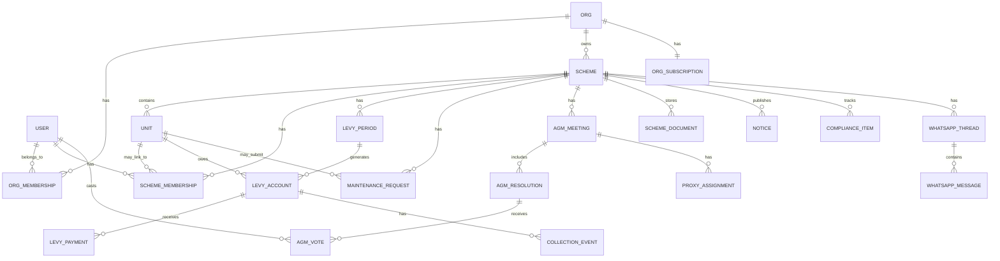
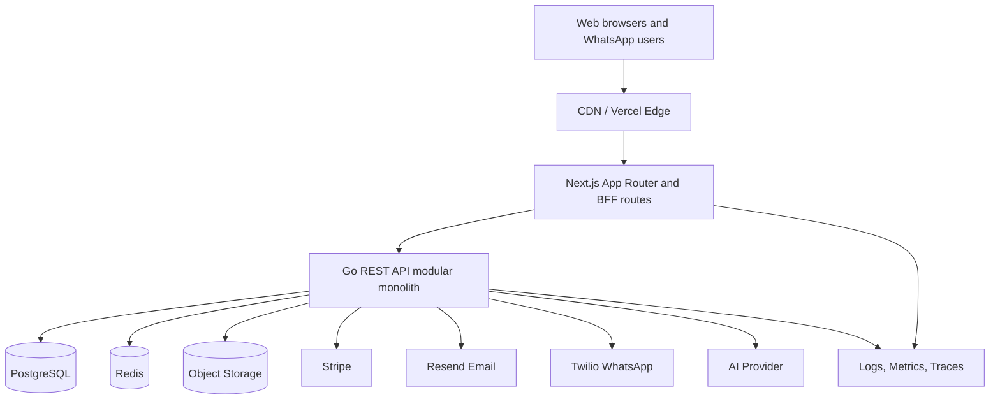
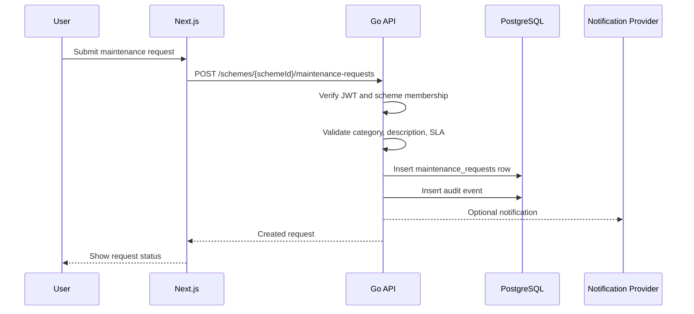

# StrataHQ System Design

Date: 2026-04-28
Status: Approved design
Scope: Interview-style early-stage system design for the existing StrataHQ platform

## 1. Requirements and Scoping

### Problem Statement

StrataHQ is a SaaS platform for South African sectional title scheme management. It helps managing agents, trustees, owners, and residents operate body corporate workflows under the Sectional Titles Schemes Management Act.

The system must support day-to-day operational workflows, preserve reliable governance and financial records, and integrate with billing, messaging, document storage, and AI services.

### Functional Requirements

- Manage managing-agent organizations, staff, schemes, units, owners, trustees, and residents.
- Support scheme-scoped levy management, payment tracking, bank reconciliation, and collection events.
- Track maintenance requests from submission through resolution.
- Manage AGM meetings, resolutions, quorum, proxy assignments, and votes.
- Store scheme documents in a secure document vault.
- Provide financial reports for budgets, reserve funds, levy collection, and expenditure tracking.
- Send notices and updates to owners and residents.
- Support WhatsApp conversations and broadcasts.
- Track compliance items and due dates.
- Manage organization subscriptions through Stripe.
- Provide an authenticated web application and REST API.
- Maintain audit trails for sensitive application access and actions.

### Non-Functional Requirements

- Scale: early-stage SaaS with about 1k managing agents and 50k owners/residents.
- Activity: about 5k-20k daily active users with business-hours traffic peaks.
- Latency: common backend reads should complete under 300 ms p95, excluding third-party provider latency.
- Availability: 99.5%-99.9% is the target for early production.
- Consistency: strong consistency for payments, voting, permissions, subscription state, and audit records.
- Security: TLS, JWT auth, server-side refresh-token rotation, role-based access control, scheme-level authorization, webhook signature verification, and encryption at rest.
- Privacy: minimize PII exposure and follow POPIA-style purpose limitation, access control, retention, and breach-response practices.

### Capacity Estimate

Early-stage assumptions:

- Organizations: 500-1,000 managing-agent organizations.
- Schemes: 5,000-10,000.
- Units: 50,000-100,000.
- Users: 50,000-100,000 owners, residents, trustees, and agents.
- API traffic: tens to low hundreds of requests per second at peak.
- Notices, WhatsApp messages, collection events, and audit events: hundreds of thousands to low millions over time.
- Documents: main storage growth driver, initially 5-20 GB and growing with PDFs, spreadsheets, and images.

## 2. Data Modeling

### Entity Relationship Model



### Core Tables

- `users`: authenticated identities.
- `orgs`: managing-agent organizations.
- `org_memberships`: links users to organizations as admin or agent.
- `refresh_tokens`: server-side refresh tokens with expiry and revocation state.
- `org_subscriptions`: Stripe subscription state per organization.
- `schemes`: sectional title schemes owned by an organization.
- `units`: physical units within a scheme.
- `scheme_memberships`: links users to a scheme and optionally a unit as owner, trustee, or resident.
- `levy_periods`: billing periods for a scheme.
- `levy_accounts`: per-unit obligations for a levy period.
- `levy_payments`: individual payments against levy accounts.
- `collection_events`: collection reminders, follow-ups, promises to pay, and legal review flags.
- `maintenance_requests`: scheme/unit maintenance issues.
- `agm_meetings`: scheme meetings.
- `agm_resolutions`: resolutions within a meeting.
- `proxy_assignments`: delegated AGM voting rights.
- `agm_votes`: votes on resolutions.
- `budget_lines`: budget and actual amounts by category and period.
- `reserve_fund`: current reserve fund state per scheme.
- `scheme_documents`: document metadata and object storage keys.
- `notices`: scheme communications.
- `whatsapp_threads`, `whatsapp_messages`, `whatsapp_broadcasts`: WhatsApp communication state.
- `compliance_items`: governance, financial, administrative, and insurance compliance checks.
- `audit_events`: request/action audit trail.

### Schema Design Decisions

- Use PostgreSQL as the authoritative database because the domain is transactional and relationship-heavy.
- Use UUID primary keys for non-guessable public identifiers.
- Store money as integer cents, never floating point values.
- Use enums for bounded workflow states, including maintenance status, AGM status, vote choice, notice type, compliance status, and WhatsApp sender.
- Use foreign keys to preserve tenant, scheme, and workflow integrity.
- Use unique constraints for correctness and idempotency:
  - one org membership per user/org
  - one scheme membership per user/scheme
  - one levy account per unit/period
  - one payment reference globally
  - one proxy grantor per meeting
  - one vote per voter/resolution
  - one WhatsApp thread per scheme/unit
- Use `created_at`, `updated_at`, and domain timestamps such as `resolved_at`, `sent_at`, `assessed_at`, `occurred_at`, and `last_active_at`.

### Normalization

Operational records should remain in third normal form:

- Users, organizations, schemes, units, and memberships are separate tables.
- Levy periods, levy accounts, and levy payments are separate to avoid duplicated financial state.
- AGM meetings, resolutions, votes, and proxies are separate to enforce governance constraints.
- Document binary data is not stored in PostgreSQL; PostgreSQL stores metadata and storage keys.

Derived dashboard data can be cached or materialized later, but source-of-truth data should remain normalized.

### SQL vs NoSQL

- PostgreSQL is the source of truth for transactional and queryable records.
- Redis is used for ephemeral cache, rate limiting, job coordination, and short-lived dashboard summaries.
- Object storage is used for document files.
- No dedicated NoSQL database is required at this stage.
- JSONB is acceptable only for bounded extensibility, such as provider metadata, webhook payload snapshots, AI trace metadata, or feature flags.

## 3. API Design

### API Style

Use REST over JSON.

REST is appropriate because StrataHQ domains are resource-oriented, the backend already follows REST-style routing, and scheme-level authorization is easier to reason about at resource boundaries. GraphQL can be deferred because it adds resolver complexity and authorization risk. gRPC is better suited to internal service-to-service calls if the monolith is split later.

### Resource Groups

```text
/api/v1/auth
/api/v1/orgs
/api/v1/orgs/{orgId}/memberships
/api/v1/schemes
/api/v1/schemes/{schemeId}
/api/v1/schemes/{schemeId}/units
/api/v1/schemes/{schemeId}/memberships
/api/v1/schemes/{schemeId}/levy-periods
/api/v1/schemes/{schemeId}/levy-accounts
/api/v1/schemes/{schemeId}/levy-payments
/api/v1/schemes/{schemeId}/collection-events
/api/v1/schemes/{schemeId}/maintenance-requests
/api/v1/schemes/{schemeId}/agm-meetings
/api/v1/schemes/{schemeId}/agm-resolutions
/api/v1/schemes/{schemeId}/documents
/api/v1/schemes/{schemeId}/notices
/api/v1/schemes/{schemeId}/financials
/api/v1/schemes/{schemeId}/compliance
/api/v1/schemes/{schemeId}/whatsapp
/api/v1/billing
/api/v1/webhooks/stripe
/api/v1/webhooks/twilio
/api/v1/ai/copilot
/health
/metrics
```

### Authentication

- Use short-lived JWT access tokens.
- Store refresh tokens server-side in PostgreSQL.
- Rotate refresh tokens and revoke them on logout.
- Auth middleware verifies the token and attaches user context to the request.

### Authorization

Authorization must be enforced in the service layer, not only in handlers.

Roles:

- Org admin: manages subscription, organization staff, and all schemes in the organization.
- Agent: operates assigned organization or scheme workflows.
- Trustee: performs scheme governance and approval actions.
- Owner: accesses own unit, notices, documents, maintenance, and voting where eligible.
- Resident: accesses allowed unit-level and communication workflows.

Every scheme-scoped endpoint must check that the actor has access to the target `schemeId`. The client must never be trusted to decide tenant or scheme access.

### Request and Response Contracts

Use JSON request and response bodies. Use a stable error envelope:

```json
{
  "error": {
    "code": "forbidden",
    "message": "You do not have access to this scheme",
    "requestId": "req_01..."
  }
}
```

Validation errors should include field-level detail:

```json
{
  "error": {
    "code": "validation_failed",
    "message": "Request validation failed",
    "requestId": "req_01...",
    "fields": {
      "dueDate": "must be a future date"
    }
  }
}
```

### Pagination and Filtering

- Use cursor pagination for append-heavy resources such as notices, WhatsApp messages, audit events, and collection events.
- Offset pagination is acceptable for small admin lists during early stage.
- Common filters: `status`, `category`, `from`, `to`, `unitId`, `schemeId`, and `actorUserId`.

### Versioning

- Start with `/api/v1`.
- Additive response changes are allowed.
- Breaking request or response changes require `/api/v2` or endpoint-specific compatibility windows.

### Idempotency

Use idempotency keys for side-effect-heavy workflows:

- Payment imports and reconciliation.
- Collection reminder sends.
- Stripe webhook processing.
- Twilio webhook ingestion.
- Document upload finalization.

Critical idempotency should be enforced through unique constraints or a dedicated idempotency table.

## 4. High-Level Architecture

### Recommended Architecture

Use a modular monolith:

- Next.js frontend on Vercel.
- Go REST API on Render.
- PostgreSQL as source of truth.
- Redis for cache, rate limiting, and job coordination.
- Object storage for files.
- External providers for billing, email, WhatsApp, and AI.

This architecture keeps early-stage deployment and data consistency simple while preserving clear module seams for later extraction.



### Frontend

The Next.js application handles:

- Marketing and auth pages.
- Agent portfolio dashboard.
- Scheme-scoped dashboards.
- Setup wizard.
- Module pages for levy, maintenance, AGM, documents, compliance, communications, and financials.
- Frontend-specific API/BFF routes where server-side secrets or proxy behavior are required.

React Query handles client-side cache and invalidation. Server-side routes call the Go API using backend-only environment variables.

### Backend

The Go API owns:

- Business logic.
- Authorization.
- Database transactions.
- Provider webhooks.
- Audit records.
- Domain APIs.
- Metrics and health endpoints.

Domain modules:

- auth
- scheme
- levy
- maintenance
- AGM
- documents
- communications
- billing
- compliance
- WhatsApp
- AI
- audit

### Storage

- PostgreSQL stores transactional data.
- Redis stores ephemeral data and short-lived computed results.
- Object storage stores uploaded files.

### External Integrations

- Stripe: subscriptions, checkout sessions, webhook updates.
- Resend: email notices and collection reminders.
- Twilio WhatsApp: inbound/outbound WhatsApp workflows.
- AI provider: copilot responses.
- Object storage provider: document upload and download.

### Request Flow

```text
Browser
  -> CDN / Vercel Edge
  -> Next.js App Router
  -> Go REST API
  -> PostgreSQL / Redis / Object Storage
  -> External providers where needed
```

### Webhook Flow

```text
Stripe/Twilio
  -> Go webhook endpoint
  -> signature verification
  -> idempotency check
  -> database transaction
  -> audit/log/metric event
```

### Async Processing

At early stage, use a Go worker process or scheduled jobs with PostgreSQL and Redis. Jobs should handle:

- Collection reminder delivery.
- Notification retries.
- Webhook retry handling.
- Maintenance SLA checks.
- Report precomputation.
- Document virus scanning later.

Kafka or RabbitMQ should be deferred until throughput, team size, or cross-service requirements justify the added operational complexity.

## 5. Low-Level Design

### Backend Module Structure

Use this module pattern:

```text
handler -> service -> sqlc queries / provider clients
```

Responsibilities:

- Handler: parse request, validate request shape, call service, write response.
- Service: authorize actor, apply business rules, manage transactions, call queries and providers.
- Query layer: typed SQL generated by sqlc.
- Provider clients: Stripe, Resend, Twilio, object storage, AI.
- Middleware: auth, request ID, logging, recovery, CORS, security headers, body limits, rate limits, metrics, audit capture.

### Design Patterns

- Transaction script in service methods for workflows that require strong consistency.
- Adapter pattern for external providers.
- Strategy pattern for payment matching and notification channel selection.
- Repository/query abstraction through sqlc-generated methods.
- Outbox pattern later for reliable async delivery once notification or webhook processing needs stronger guarantees.
- Dependency injection for testability and provider substitution.

### Flow: Create Maintenance Request



### Flow: AGM Vote

```text
Owner/trustee submits vote
  -> POST /agm-resolutions/{resolutionId}/votes
  -> verify authenticated user
  -> check scheme membership and voting eligibility
  -> check meeting and resolution are open
  -> insert vote with UNIQUE(resolution_id, voter_user_id)
  -> update resolution tallies in the same transaction
  -> return updated resolution state
```

### Flow: Levy Payment Reconciliation

```text
Bank statement or payment input
  -> normalize amount, reference, date, and unit matching data
  -> match to levy account by reference, unit, or reconciliation rules
  -> insert levy_payment with unique reference
  -> recalculate paid_cents and levy account status
  -> create collection event if account remains partial or overdue
  -> commit transaction
```

### Frontend Flow

- Page components load authenticated data through typed API clients.
- Shared `lib/*-api.ts` modules define request and response contracts.
- React Query owns client caching, loading states, and invalidation.
- Scheme-scoped pages derive `schemeId` from route params.
- Server actions and proxy routes call the Go backend without exposing backend-only secrets.

## 6. Scalability and Reliability

### Scaling Strategy

- Scale Next.js through Vercel.
- Scale the Go API horizontally behind Render or a load balancer.
- Keep API instances stateless.
- Store durable state in PostgreSQL.
- Store ephemeral cache and coordination data in Redis.
- Split workers from web API once background processing becomes slow or bursty.
- Add PostgreSQL read replicas when dashboard/reporting reads justify them.

### Database Scaling

- Use indexes on `scheme_id`, `org_id`, workflow status fields, and timestamp fields.
- Keep common access patterns scheme-scoped and tenant-scoped.
- Use connection pooling to protect PostgreSQL from traffic spikes.
- Add read replicas for read-heavy reporting.
- Partition high-volume append-only tables later:
  - `audit_events`
  - `whatsapp_messages`
  - `collection_events`
- Sharding is not needed at early stage. If required later, shard by `org_id` or `scheme_id`.

### Caching

- CDN caches static assets and public marketing pages.
- React Query caches browser-side reads.
- Redis caches hot dashboard summaries with short TTLs.
- Redis rate limits auth, webhook, AI, and expensive report endpoints.
- Do not cache authorization decisions beyond the request/session without careful invalidation.

### Consistency Model

Strong consistency is required for:

- Payments and levy balances.
- AGM votes and resolution tallies.
- Membership and permission changes.
- Subscription status transitions.
- Audit event persistence.

Eventual consistency is acceptable for:

- Dashboard summaries.
- Notification delivery status.
- AI copilot responses.
- Search indexes.
- Cached analytics.

### Reliability Strategy

- PostgreSQL automated backups and point-in-time recovery.
- Redis treated as disposable cache except for job coordination; jobs must be retryable.
- Provider calls use timeouts, retries with backoff, and idempotency keys.
- Webhooks verify signatures, persist processing state, and safely reject duplicates.
- Critical writes happen in PostgreSQL transactions.
- Failed provider delivery is recorded and retried rather than losing state.

### Degraded Mode

- Stripe outage: normal application reads should continue; subscription updates pause.
- Resend/Twilio outage: record failed delivery status and retry.
- AI outage: return fallback response and keep core workflows available.
- Object storage outage: block document upload/download but keep unrelated scheme operations online.
- Redis outage: disable cache and rate-limit features conservatively; core database-backed workflows should continue where safe.

### CAP Framing

During network partitions:

- Prefer consistency over availability for auth, payments, voting, and billing.
- Prefer availability with eventual consistency for dashboards, notifications, cached summaries, and AI responses.

## 7. Observability

### Logging

Use structured JSON logs with:

- `request_id`
- `actor_user_id`
- `org_id`
- `scheme_id`
- route pattern
- HTTP method
- status code
- latency
- provider call status
- error code

Application logs and audit events must remain separate. Audit events are product/security records, not just troubleshooting data.

### Metrics

Collect:

- HTTP request count, latency, and error rate by route.
- PostgreSQL query latency and connection pool saturation.
- Redis latency and error rate.
- Webhook success, failure, and duplicate counts.
- Notification delivery success and failure.
- Background job duration, retries, and dead-letter counts.
- AI provider latency, token usage, and failure rate.
- Document upload and download latency/failure rate.

### Tracing

Use distributed tracing when calls cross:

- Next.js frontend/server routes.
- Go API handlers and services.
- PostgreSQL.
- Redis.
- External providers.

Every error response should include a request ID so support can connect user-reported failures to logs and traces.

### Alerting

Initial alerts:

- API 5xx rate above threshold.
- Auth failure spike.
- Webhook failure spike.
- Database connection pool exhaustion.
- High p95/p99 latency on critical routes.
- Background job retry/dead-letter spike.
- Document storage failures.
- Provider outage detection for Stripe, Resend, Twilio, and AI.

## 8. Security

### Transport and Storage Security

- TLS for all external traffic.
- Managed encryption at rest for PostgreSQL disks, Redis where supported, and object storage.
- Signed document download URLs with short TTLs.
- Private buckets for document storage.

### Identity and Access

- Hash passwords with a modern password hashing algorithm.
- Use short-lived JWT access tokens.
- Store refresh tokens server-side and rotate them.
- Revoke refresh tokens on logout or suspicious activity.
- Enforce RBAC in services.
- Enforce scheme-level authorization for every scheme-scoped endpoint.

### API Hardening

- CORS allowlist.
- Security headers.
- Request body limits.
- Rate limiting for auth, webhooks, AI, and expensive report endpoints.
- Panic recovery middleware.
- Stable error codes without leaking internals.
- Input validation at API boundaries and service boundaries.

### Webhook Security

- Verify Stripe and Twilio signatures.
- Use provider-specific replay windows where available.
- Store processing state to reject duplicates.
- Process side effects idempotently.

### Data Privacy

- Minimize PII in logs.
- Avoid sending sensitive financial or personal data to AI providers unless explicitly required and controlled.
- Use least-privilege provider keys.
- Keep separate secrets per environment.
- Define retention policies for audit logs, communications, webhook payloads, and inactive accounts.

### Zero-Trust Principles

- Treat frontend inputs, route params, provider callbacks, and AI outputs as untrusted.
- Reauthorize every request at the backend.
- Never let the client choose or assert scheme/org access.
- Validate external provider payloads before use.

## 9. Infrastructure

### Environments

- Local: Next.js dev server, Go API, Docker Compose PostgreSQL and Redis.
- Staging: production-like Vercel frontend, Render backend, managed PostgreSQL/Redis, sandbox provider credentials.
- Production: Vercel frontend, Render backend, managed PostgreSQL, managed Redis, object storage, live provider credentials.

### Deployment

Frontend:

- Build and deploy through Vercel.
- Configure `BACKEND_URL` for server-side API calls.
- Configure `NEXT_PUBLIC_API_URL` only for safe browser-visible API base URLs.

Backend:

- Build Go binary.
- Run migrations before or during deploy using a controlled release step.
- Start web API process.
- Start worker process separately when background jobs are introduced.

### Secrets

- Store secrets in managed environment variables.
- Never commit provider keys or database URLs.
- Use separate secrets for local, staging, and production.
- Rotate webhook secrets and API keys periodically.

### Database Operations

- Goose migrations manage schema changes.
- sqlc generates typed query code.
- Enable automated backups and point-in-time recovery.
- Test migrations against staging before production.
- Add safe rollback plans for destructive migrations.

### Disaster Recovery

- Define recovery time objective: 4 hours for early stage.
- Define recovery point objective: 15-60 minutes depending on managed database PITR capability.
- Run restore drills before production launch and after major schema changes.

## 10. Future Evolution

Keep the modular monolith until one of these conditions is true:

- A domain has independent scaling needs.
- A separate team owns a domain.
- Provider webhook or notification workloads interfere with web API latency.
- Compliance or tenant isolation requirements require stronger boundaries.

Likely extraction order:

1. Background worker for notifications, reminders, and webhook retries.
2. Document service for upload/download, virus scanning, and storage policies.
3. Communications service for email and WhatsApp fan-out.
4. Reporting/read-model service for large analytics workloads.
5. Billing service if subscription complexity grows.

Do not introduce Kafka, RabbitMQ, or microservices before measurable operational need exists.

## 11. Key Tradeoffs

### Modular Monolith vs Microservices

Modular monolith is preferred now because it keeps deployment, transactions, debugging, and schema evolution simple. Microservices would add distributed failure modes, service discovery, and operational overhead before the product has scale or team-size pressure.

### PostgreSQL vs NoSQL

PostgreSQL is preferred because the system needs joins, constraints, transactions, and strong consistency. NoSQL would make financial, voting, and membership correctness harder.

### REST vs GraphQL

REST is preferred because it maps cleanly to scheme-scoped resources and is easier to secure endpoint by endpoint. GraphQL can be considered later for complex dashboards, but only with strong resolver-level authorization controls.

### Synchronous vs Async Workflows

User-facing writes should commit authoritative database state synchronously. Slow external side effects should be async or retryable so provider failures do not corrupt core records.

## 12. Interview Summary

StrataHQ should start as a Next.js frontend backed by a Go modular monolith, PostgreSQL, Redis, and object storage. PostgreSQL remains the source of truth for normalized transactional records. Redis handles cache, rate limits, and coordination. External providers handle Stripe billing, email, WhatsApp, object storage, and AI.

The design prioritizes correctness for financial, governance, auth, and audit workflows while allowing eventual consistency for dashboards, notifications, and AI responses. It scales horizontally at the frontend and API layers, adds read replicas and workers when needed, and defers microservices and message brokers until the system has clear operational pressure.
